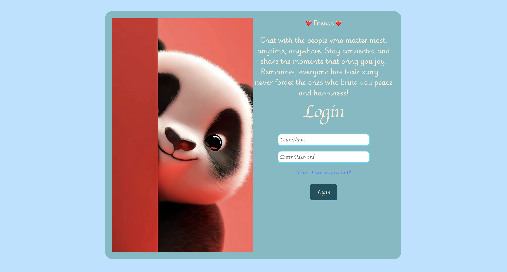
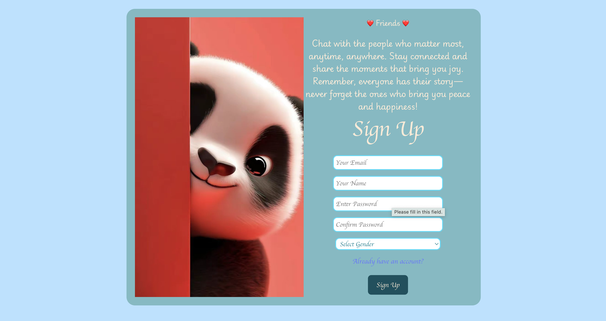
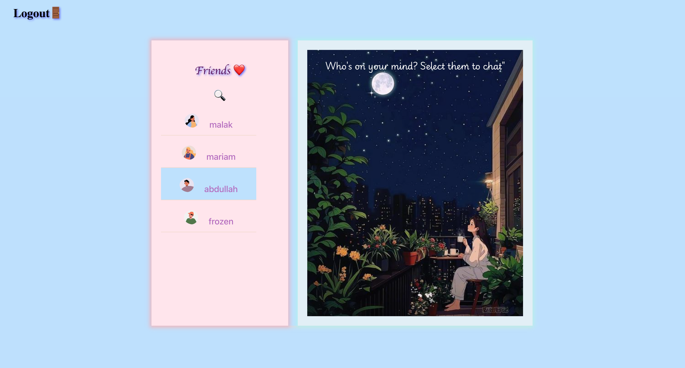
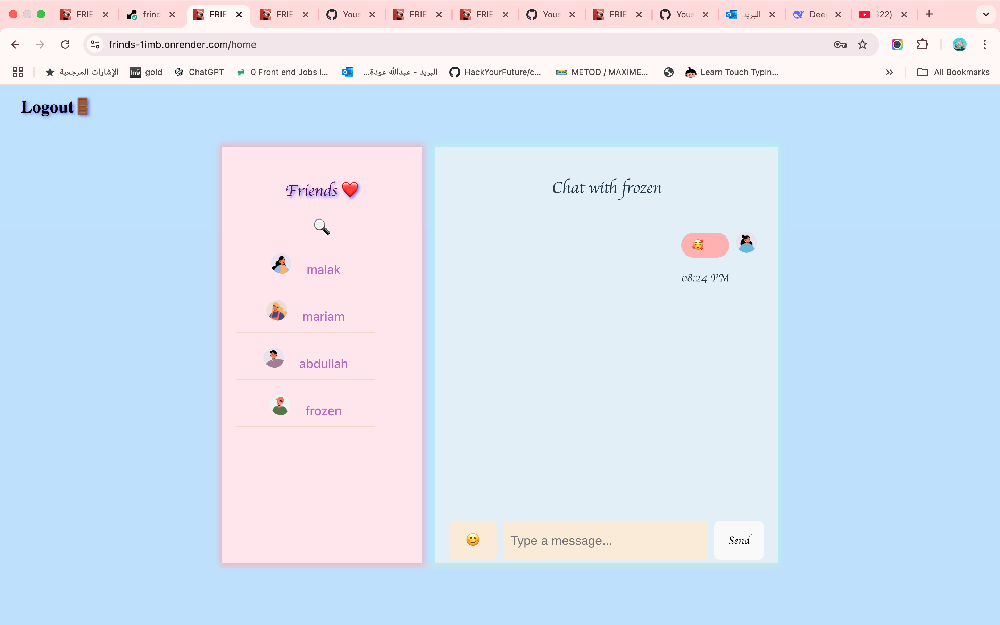

*Friends
<div align="center">
  
  
  
  
</div>
## Overview

The Frindes is a real-time messaging application built using React for the frontend and Express.js with MongoDB for the backend. The app allows users to chat with their friends, search for users, and manage authentication. It also includes features like emoji support, real-time updates, and user-friendly UI.

## Features

- **Authentication**: Users can sign up, log in, and securely access their accounts.
- **Search Users**: Easily find friends using the search functionality.
- **Real-Time Messaging**: Messages are updated every 6 seconds for a seamless chat experience.
- **Emoji Picker**: Add emojis to your messages using an integrated emoji picker.
- **Error Handling**: Comprehensive error handling ensures a smooth user experience.

## Tech Stack

### Frontend
- React
- React Router
- Axios
- Date-fns (for date formatting)
- Emoji Picker
- CSS for styling

### Backend
- Express.js
- MongoDB with Mongoose
- dotenv (for environment variables)
- cors

## Installation and Setup

### Prerequisites
- Node.js
- MongoDB
- npm or yarn

### Steps

1. **Clone the Repository**:
   ```bash
   git clone <repository-url>
   npm run build 
   npm install
